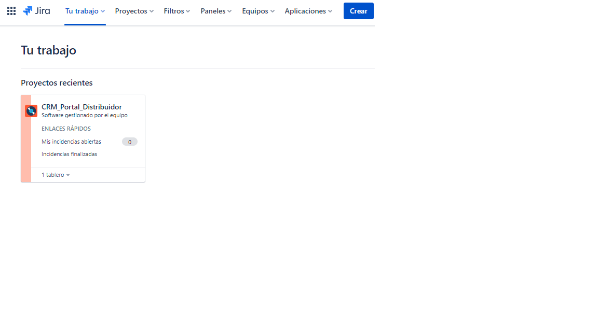
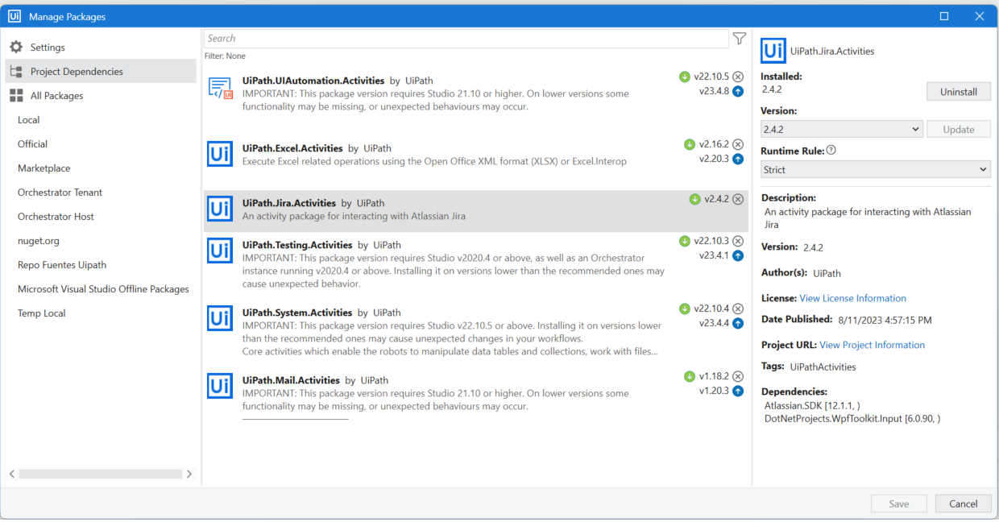
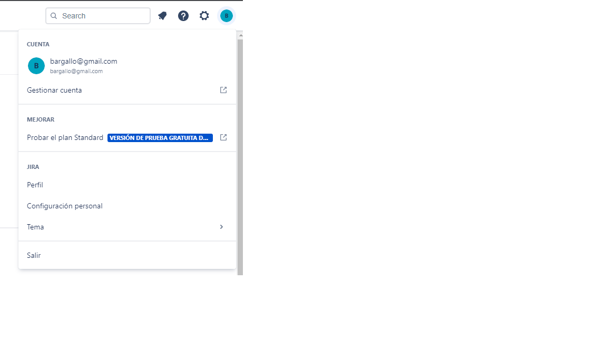
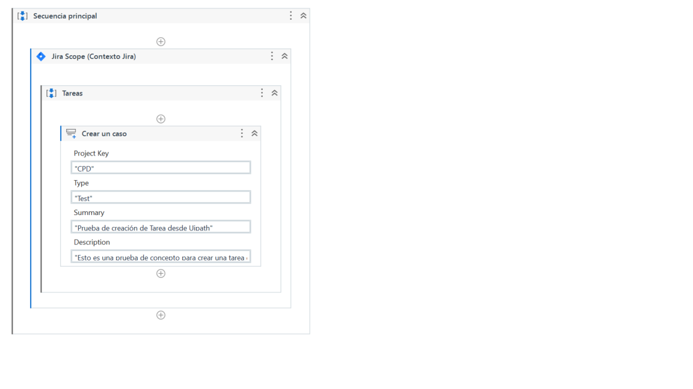
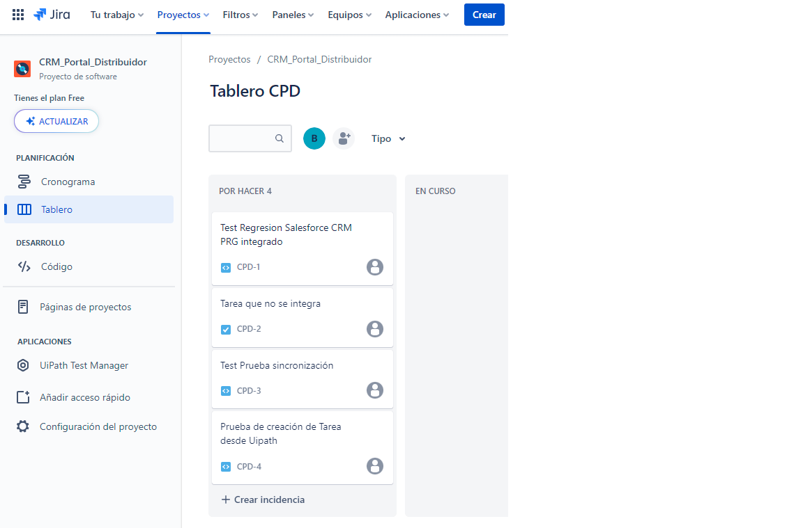

# Tutorial comunicarse con Jira con Uipath

## Configuración Jira 

Necesitamos un proyecto en Jira:

En mi caso me he creado uno en mi Jira community [Bargallo Jira] (https://bargallo.atlassian.net/jira/your-work):

## Uipath Automation

Añadir la libreria Jira Activities:

Seleccionar la actividad de Jira Scope.

Acceder a la cuenta de Jira, seleccionando "Gestionar cuenta":

Ir a seguridad:

Si no esta creado "Crear y gestionar tokens de API" y crear el token (en mi caso UipathAutomationDemo):

`Token de API:ATATT3xFfGF0bQi_pm8D8cl9-RUsf7FxVi-M502hDGMuX1leGg1IqheSaYEjuDaiF3NI6aHbjMOpde4hRPjuSrtPkYoSOhAlLbGIHJE6Ky0GsRi5iC_RM5z8N8SWh2FvGCYY9WQE1LPCnt5NV1RoRLKkwrmwaN_ejO9A6CFT6PNhVGIvUIWZDCk=CF11BF46`

Asegúrate de copiar el nuevo token de API. No podrás verlo de nuevo.

Ahora ya tenemos la URL y el token necesario para la actividad de Scope:

Ahora podemos **Crear/Modificar/Borrar** casos en Jira

Por ejemplo Crear:

Y el resultado seria:

